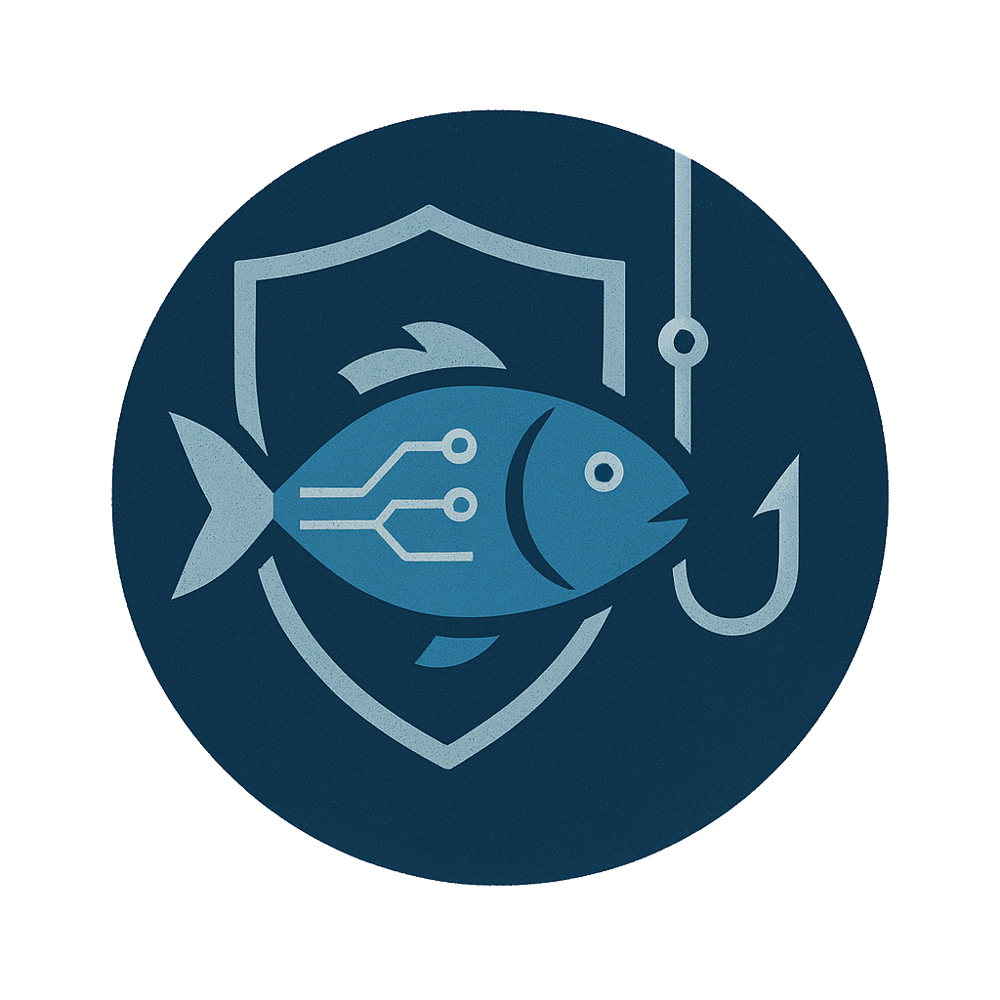

# Phishing-Awareness-Chatbot

An AI-powered platform that helps organizations run phishing-awareness campaigns with simulated scenarios, reporting, and monitoring.

## What's in this repo

- Frontend: Vue 3 + Vite app in `Application/pac-front`
- Backend: FastAPI microservices in `Application/pac-back/src`
- Docs: `Documentation/` (schema, roadmap, contribution guide)

## Tech stack

- Frontend: Vue 3, Vite, Tailwind
- Backend: FastAPI (Python), Docker
- Data: Supabase (Postgres)
- AI/Email integrations: OpenAI, Langfuse, Resend

## Architecture

Services and default ports (Docker):

- Authentication API: `http://localhost:8001` (`/docs` for Swagger UI)
- Challenges API: `http://localhost:8002` (`/docs` for Swagger UI)
- Monitoring API: `http://localhost:8003` (`/docs` for Swagger UI)
- Agentic API: `http://localhost:8004` (`/docs` for Swagger UI)
- Clocking API: `http://localhost:8005` (`/docs` for Swagger UI)
- Frontend (nginx + built assets): `http://localhost:8080`

## Prerequisites

- Docker + Docker Compose
- Node.js 18+ (only if you want to run the frontend in dev mode)

## Configuration

Backend env file:

1. Copy `Application/pac-back/envs/.env.example` to `Application/pac-back/envs/.env`.
2. Fill in Supabase, OpenAI, Langfuse, Resend, and other keys.

Frontend env file:

1. Copy `Application/pac-front/.env.example` to `Application/pac-front/.env`.
2. Set the `VITE_*` variables for local development.

For tests, use `Application/pac-back/envs/.env.test.example` as a template for `Application/pac-back/envs/.env.test`.

## Run the stack

Full stack (backend + frontend build):

```bash
docker compose -f Application/docker-compose-full-build.yaml up --build
```

The full-stack compose uses nginx to expose backend APIs under `http://localhost:8080/api/*`
and proxies to the services above (see `Application/pac-front/nginx.conf`).

Backend only:

```bash
cd Application/pac-back
docker compose up --build
```

Frontend dev server (optional, for local UI work):

```bash
cd Application/pac-front
npm install
npm run dev
```

## Tests

Run backend unit tests in Docker:

```bash
docker compose -f Application/pac-back/local-backend-tests-docker-compose.yml up --build --abort-on-container-exit
```

## Documentation

- Database schema: `Documentation/DATABASE_SCHEMA.md`
- Contribution guide: `Documentation/CONTRIBUTION.md`
